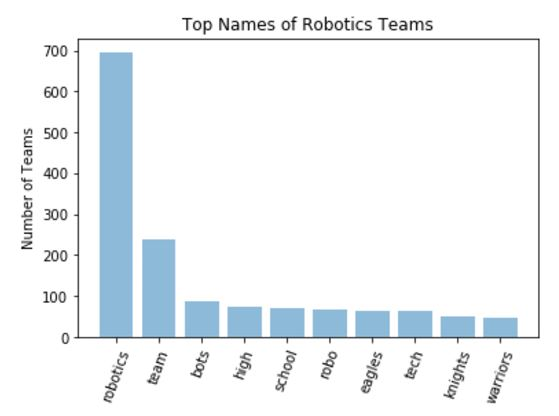
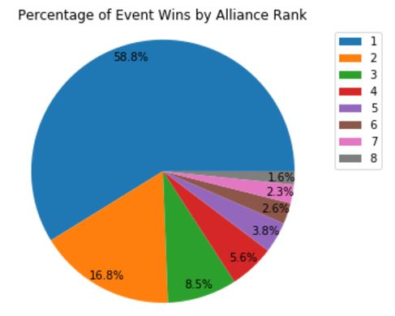
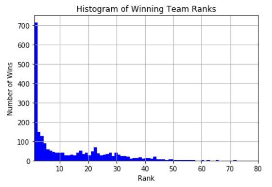
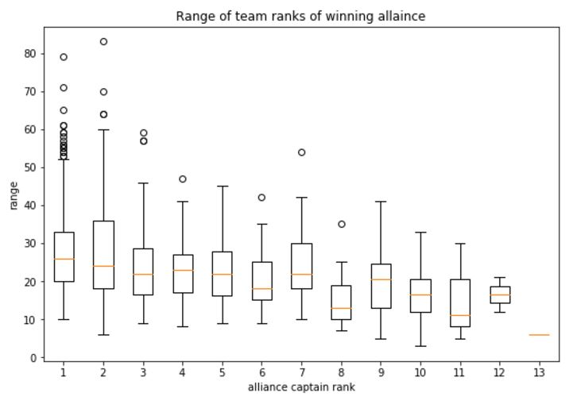

# Samantha Hay Final Exam
### Requirements:
* Pull data from an API, store it porperly, perform 3 analyses of the data and explain them

## Background:

For my final exam, I wanted to pull data from the FIRST Robotics Competition (FRC) database. FRC is a compeition for high school students where they are given 6 weeks to build a 120-lb robot to compete in a unique competition against teams from around the world. These games are played with 3 teams playing against 3 teams. These alliances of 3 are randomly selected for the first 60 or so qualification matches, with determine the team rankings. This means that teams may be playing against a team one match and alongside them the next. 

After rankings are determined, alliances are choosen for the elimination rounds. The 1st rank alliance chooses first, then the 2nd, going down to the 8th. Then the 8th alliance captain will choose a 2nd team, then the 7th, and back up to the 1st. Teams within the top 8 can choose each other. If this happens, the next highest rank team will take the  8th spot and all teams will move up until the empty seat is filled.

In the elimination rounds, the 1st alliance will play against the 8th alliance, 7th will play against 2nd, and so on for a best two out of three qualification matches per pair. The winners of those advance to the semi finals and play in the same structure, which then repeats for the two teams in the finals. One alliance of three teams will win the compeition.

FIRST was invented in 1992 and has grown significantly since then. As the company was founded by a group of engineers and has a significant fan base of other engineers, there is a good amount of data available. Modern competition fields also push live data automatically from all over the world to the API during these competitions, so this data can change daily.

## API:
I used the API from https://www.thebluealliance.com/apidocs which pulls data directly from the FIRST Field Management System and formats it for easier access. It also has significantly better doccumentation, especially compared to other APIs like the New York Times.

## Storing Data:
the code in the pullData notebook pulled the data from the API and stored it in an easily accessible format. The key used for this is not private, instead The Blue Alliance (TBA) simply requested my name, team number, and why I want data, and to format that information as an API key. 

I pulled two sets of data - Team data and Event data. The team data set has information on all teams, in the form of one text file per team. When team data is updated, nothing is overwritten and all information is preserved based on the internal data structure, so files are simply labeled with the team number.

Next, event data was pulled. This is sorted by year as the same event name can be held multiple years. Inside each year folder is another folder for each event. Inside each event's folder are seperate files for the different data types: the event ectription data, alliances data, award data, and rankings data. Awards and Rankings data can be updated and different at differnt points in time, so those are appended with the dae the data was pulled. 

## Analysis \# 1: Words in Team Names

### Introduction:

There are thousands of team names over the world, each with a unique team name. Teams love finding similar team names. For example, my high school had "The Force Team" and there is a team in Maine called "The Northern Force" and another one in NH called "Gael Force". After doing this analysis, apparantly 21 different teams have the word "Force" in their team name, which is really cool!

### Analysis:

The bar chart above shows the top 10 words in team names and the number of teams with those words in their name. As I was reading through the list, I noticed that reading sequential words (sorted by frequency), sounded like actual teams that could exist, so I made a random team name generator with the words weighted by their frequency.

Some team names that were generated:
* stampede cyber masters
* bb-r8ers stag attack
* enigma frostbots iron
* metal ravens robotic
* falcons voltage robotics
* gila robocats army
* roborebels high pack
* tigers the winger
* molten bots drive

## Analysis \# 2: What Alliances Win Competitions?

### Introduction:

As explained above, 8 alliances of 3 teams enter the elimination rounds and one team wins. As the 1st alliance includes the top ranked team and has first pick of a partner, they usually win. However, sometimes there is an upset. Recently, my high school team was picked first by the 8th alliance and that team won. This is likely because the 8th allaince captain picks teams twice in a row, they get a more even distribution of skill and therefore has a chance to pull an upset. After they won, we were trying to remember other times that the lowest ranked alliance managed to win a full competition and came up empty.

### Analysis:

The pie chart above shows the percentage of competition wins by each alliance rank. This data was pulled by comparing the team numbers who won the "Winner" award to the alliance rankings to get the rank of the winning alliance. The 8th ranked alliance only wins 1.6% of the time, which means my high school team did really well!

## Analysis \# 3: Rankings of Winning Teams

### Introduction:

Next, i wanted to look at the ranks of all teams on the winning alliances. Higher ranked alliances pick their first team earlier and the 2nd team later than the other alliances, so there should be a wider range of the higher alliances. The important question for teams like mine that tend to do well, but not amazing, is: if the team can't get in a position to be an alliance captain, what is the best rank to shoot for?

### Analysis 3A:

This is a histogram (with a bin width of 1, so basically a bar chart but easier to generate) of the ranks of each team on every winning alliance. The interesting factor the spike around 22-23. This means that if a team can't get into the top 10, they should shoot for rank 22-23 because ranks higher and lower than that have lower probabilities of winning the events.

### Analysis 3B:

Additionally, I wanted to look at the ranges of these alliances and the ranks inside them. Usually, the third robot on a top alliance is ranked a lot lower than the other two robots and then can get treated as a lower tier defense only robot, or "cheesecaked" by adding parts to a 'bland' robot design. This is a very different alliance corporation system than alliances with similarly ranked robots.

This shows that lower ranked alliances have smaller rank ranges (max - min ranks). Suprisingly, it shows some deviations around 2 and 7, which shows that those alliances typically have more variation in their robot picks. This is likely due to those alliance working harder on scouting (determining which robot to pick, independent of rank) - The 2nd ranked alliance will generally have good scouting because they obviously have a good robot and could pick a lower rank good bot to keep the 1st alliance from getting it in the alst round. Alliance 7 needs good scouting to make it to the finals as they will be against alliance 2 and the odds are against them. 9-13 here exist because of what I like to call "insest" which is when teams in the top 8 pick each other in the first round so everyone has to move up. There are fewer instances of those as they are not guaranteed to exist, but have tight ranges as they get to pick two teams in close succession, so will likely pick two high ranked teams as they should still be availible, which confirms my predicitons. 

An interesting thing to note is the rank 13 alliance captain. In order for a rank 13 team to be an alliance captain, all teams in the top 12 would have to pick each other. Rank 13 teams do not usually prepare full team pick lists, which can mean they go in to alliance selection unprepared. For that underdog to be on here, as I only used winning alliance data, is amazing! 